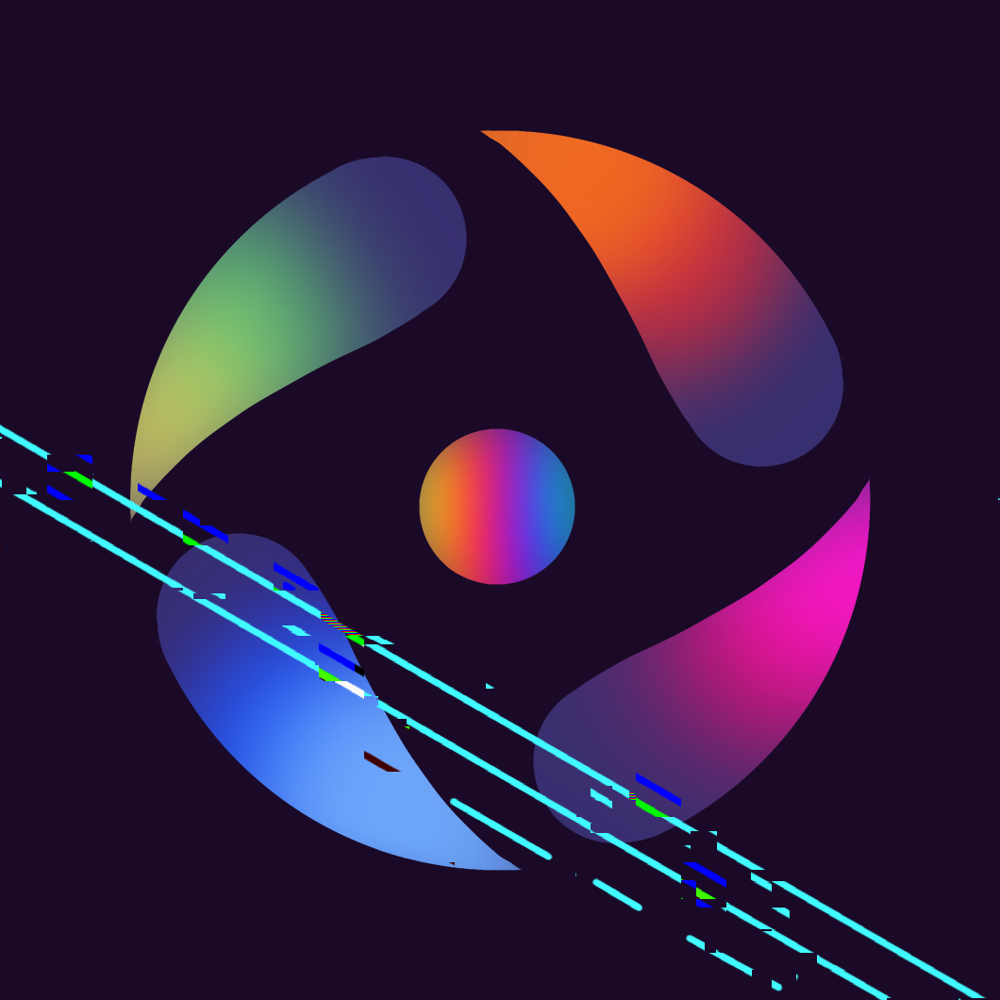

# codeish
The process of digitalization has progressed rapidly. This influences various people in their jobs or in their education.
Code\[ish] is an App (prototype) for students and teachers in primary school. It helps pupils understand
how Computers work and shows basics of technologies.

## Intro
This project was created to support a bachelor thesis. 

The main objective of this prototype was to determine if an implementation of a mobile application 
could support pupils aged eight to ten, to engage more often with information technologies 
and hence increase their digital skills. 

